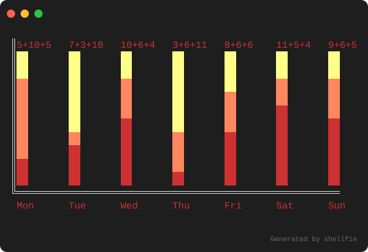
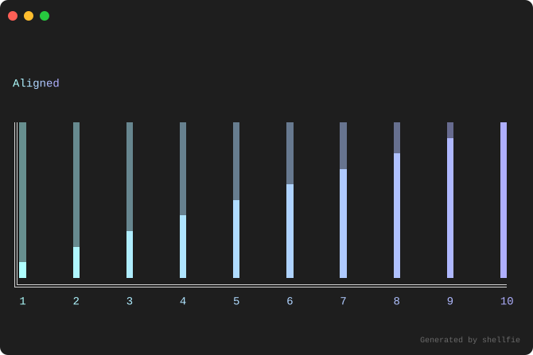
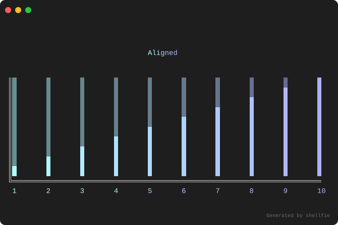
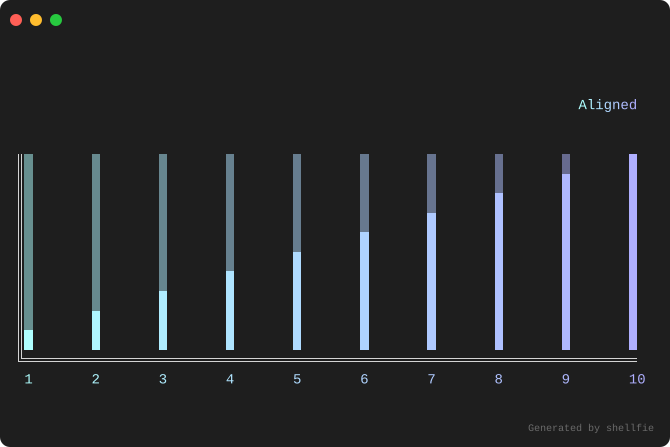

<h1 align="center"> 
Chartscii
</h1>
<p align="center">
Beautiful ASCII charts for your terminal


</p>
Transform your data into stunning ASCII bar charts with full color support, stacked bars, vertical layouts, and rich text formatting.

---

# What's New in v4

✅ Stacked charts - create multi value bar charts.  
✅ Label format - full label format control.  
✅ Title - alignment, padding and centering options.  
✅ Bar alignment - justify, center, left/right/top/bottom (depending on orientation).  
✅ Gradient charts - create vertical/horizontal/diagonal gradient charts.  
✅ Fill color - automatically follow gradient/color or separately.  
✅ Relative scaling control - relative and absolute.  
✅ Auto color mode - cycle through colors automatically.  
✅ 5 new chart types - line, step, scatter, candlestick and status charts.  
✅ Animate - create chart animations (using cursor reset).

---

## Installation

```bash
npm install chartscii
```

For CLI usage, see [chartscii-cli](https://github.com/tool3/chartscii-cli).

---

## Quick Start

```typescript
import Chartscii from "chartscii";

const data = Array.from({ length: 10 }, (_, i) => i + 1);
const chart = new Chartscii(data, {
  width: 50,
  theme: "pastel",
  barSize: 2,
  orientation: "vertical",
  color: "pink",
});

console.log(chart.create());
```


---

## Input Formats

### Simple Numbers

```typescript
const chart = new Chartscii([1, 2, 3, 4, 5]);
```

### Chart Points

```typescript
const data = [
  { label: "Sales", value: 100, color: "green" },
  { label: "Returns", value: 25, color: "red" },
  { label: "Pending", value: 40, color: "yellow" },
];
```

### Stacked Chart Points

```typescript
const data = [
  { label: "Jan", value: [25, 25, 50], color: ["green", "yellow", "red"] },
  { label: "Feb", value: [22, 68, 10], color: ["green", "yellow", "red"] },
  { label: "Mar", value: [40, 10, 50], color: ["green", "yellow", "red"] },
];
```

```typescript
const chart = new Chartscii(data, { colorLabels: true, valueLabels: true });
```

| Property | Type                   | Description                         |
| -------- | ---------------------- | ----------------------------------- |
| `label`  | `string`               | Bar label (defaults to value)       |
| `value`  | `number` or `number[]` | Bar value or array for stacked bars |
| `color`  | `string` or `string[]` | Bar color or per-segment colors     |

---

## API

```typescript
const chart = new Chartscii(data: InputData[] | InputData[][], options?: ChartOptions);
chart.create(); // returns the chart as a string
```

```typescript
type InputData =
  | number
  | {
      // bar / line / step / scatter:        number
      // stacked bar:                        number[]  or  { value: number; color?: string }[]
      // candlestick:                        [open, high, low, close]  (number[])
      // status (grid mode):                 number | string  (status key)
      // status (row mode):                  number[] | string[]  (one cell per entry)
      value: number | number[] | string | { value: number; color?: string }[];
      label?: string;
      color?: string | string[];
    };
```

> Multi-series `line` / `step` / `scatter` charts accept `InputData[][]` — one inner array per data point, with one entry per series:
>
> ```typescript
> const data: InputData[][] = months.map((m, i) => [
>   { value: salesA[i], label: m },   // series 1
>   { value: salesB[i], label: m },   // series 2
> ]);
> ```

---

## Configuration

<details>
<summary><strong>All Options</strong></summary>

| Option                     | Type                           | Default        | Description                                                                            |
| -------------------------- | ------------------------------ | -------------- | -------------------------------------------------------------------------------------- |
| `type`                     | `ChartType`                    | `'bar'`        | `'bar'`, `'line'`, `'step'`, `'scatter'`, `'candlestick'`, `'status'`                  |
| `width`                    | `number`                       | `100`          | Chart width in characters                                                              |
| `height`                   | `number`                       | `10`           | Chart height in lines                                                                  |
| `padding`                  | `number`                       | `0`            | Space between bars / cells                                                             |
| `barSize`                  | `number`                       | `1`            | Thickness of each bar / candlestick body / status cell                                 |
| `orientation`              | `string`                       | `'horizontal'` | `'horizontal'` or `'vertical'` (bar charts only)                                       |
| `alignBars`                | `string`                       | `'justify'`    | Bar alignment                                                                          |
| `title`                    | `string \| TitleConfig`        | `''`           | Chart title                                                                            |
| `char`                     | `string`                       | `'█'`          | Character used for bars                                                                |
| `fill`                     | `string`                       | —              | Fill character for empty space (line/step area fill on bar charts)                     |
| `fillColor`                | `string`                       | —              | Fill color or `'auto'`                                                                 |
| `color`                    | see [Color forms](#color-forms) | —             | Bar color, gradient, `'auto'`, per-series array, `[bull, bear]`, or status map         |
| `theme`                    | `string`                       | `''`           | Theme name from styl3                                                                  |
| `naked`                    | `boolean`                      | `false`        | Hide structure characters                                                              |
| `labels`                   | `boolean`                      | `true`         | Show bar / x-axis / cell labels                                                        |
| `colorLabels`              | `boolean`                      | `true`         | Color the labels                                                                       |
| `valueLabels`              | `boolean`                      | `false`        | Show values on bars (segment values for stacked)                                       |
| `valueLabelsFloatingPoint` | `number`                       | —              | Decimal precision                                                                      |
| `labelFormat`              | `function`                     | —              | Custom label formatter                                                                 |
| `valueLabelFormat`         | `(values: string[]) => string` | —              | Custom value label formatter                                                           |
| `percentage`               | `boolean`                      | `false`        | Show percentages                                                                       |
| `sort`                     | `boolean`                      | `false`        | Sort ascending                                                                         |
| `reverse`                  | `boolean`                      | `false`        | Reverse order                                                                          |
| `scale`                    | `string \| number`             | `'auto'`       | `'auto'`, `'relative'`, `'relative-zero'`, or number                                   |
| `stackColors`              | `string[]`                     | —              | Stacked segment colors                                                                 |
| `stackLabels`              | `string[]`                     | —              | Stacked segment labels                                                                 |
| `richLabels`               | `boolean`                      | `true`         | Enable styl3 rich text decorators in labels                                            |
| `structure`                | `object`                       | —              | Custom border characters                                                               |
| `variant`                  | `'sharp' \| 'smooth'`          | `'sharp'`      | `step` corner style (`smooth` rounds with `╭╮╰╯`); `line` ignores (always `'sharp'`)   |
| `points`                   | `boolean`                      | `false`        | Draw a marker at each data point on `line` / `step`                                    |
| `pointChar`                | `string`                       | `'●'`          | Character used for point markers (also `scatter`'s default marker)                     |
| `legend`                   | `boolean \| LegendConfig`      | `false`        | Show a legend on multi-series `line` / `step` / `scatter`, on `candlestick`, `status`  |

</details>

<details>
<summary><strong>Scaling Modes</strong></summary>

| Mode              | Behavior                                                 |
| ----------------- | -------------------------------------------------------- |
| `'auto'`          | Absolute scaling from 0 to max                           |
| `'relative'`      | Maps `[min, max]` → `[1, size]` — emphasizes differences |
| `'relative-zero'` | Maps `[min, max]` → `[0, size]` — max contrast           |
| `number`          | Fixed scale factor: `value / scale`                      |

</details>

<details>
<summary><strong>Structure Characters</strong></summary>

```typescript
structure: {
  x: '═',        // horizontal axis
  y: '╢',        // tick mark
  axis: '║',     // vertical axis
  topLeft: '╔',  // top-left corner
  bottomLeft: '╚' // bottom-left corner
}
```

</details>

<details>
<summary><strong id="color-forms">Color forms</strong></summary>

`color` accepts different shapes depending on chart type:

```typescript
// Any chart — single color, gradient, or auto palette
color: 'green'
color: 'gradient(pink,cyan)'
color: 'auto'

// Multi-series line / step / scatter — one entry per series
color: ['gradient(pink,cyan)', 'gradient(orange,yellow)', 'red']

// Candlestick — [bullish, bearish] (close >= open vs close < open)
color: ['green', 'red']

// Status — map of status key → color
color: { 0: 'red', 1: 'green', 2: 'yellow', 3: '#888' }
color: { ok: 'green', warning: 'yellow', error: 'red' }
```

</details>

<details>
<summary><strong>Legend Config</strong></summary>

```typescript
legend: {
  enabled?: boolean;             // default: true when `legend` is provided
  values?: string[];             // labels per series; defaults to "Series #1", "Series #2", …
  position?: 'top' | 'bottom';   // default: 'top'
  align?: 'left' | 'center' | 'right'; // default: 'left'
}
```

`legend: true` uses defaults. Single-series line/step/scatter ignore the legend (no legend would be useful with one entry). For `status`, `values` labels the status keys in legend order.

</details>

---

## Chart Types

Set `type` to switch the renderer. All types share the core options (`width`, `height`, `title`, `theme`, `color`, `naked`, …) but each has its own visual model and a few type-specific options.

### Bar (default)

```typescript
const chart = new Chartscii([10, 25, 40, 15], {
  type: 'bar', // default
  orientation: 'vertical',
  color: 'gradient(cyan,purple)',
});
```

`bar` is the original chartscii renderer — supports stacked segments, horizontal/vertical orientation, alignment (`alignBars`), value labels, and percentages.

### Line

Smooth 45° polyline through the data points. Single or multi-series.

```typescript
const chart = new Chartscii(data, {
  type: 'line',
  width: 80,
  height: 12,
  color: 'gradient(pink,cyan)',
  fill: '░',           // optional area fill below the line
  fillColor: 'pink',
  points: true,        // draw a marker (●) at each data point
  pointChar: '◈',      // override the marker char
});
```

For multi-series, pass `InputData[][]` and an array of colors:

```typescript
const chart = new Chartscii(seriesData, {
  type: 'line',
  width: 150,
  color: ['gradient(pink,cyan)', 'gradient(orange,yellow)', 'red'],
  legend: { values: ['Q1', 'Q2', 'Q3'], position: 'top', align: 'right' },
});
```

Notes:
- `variant` only matters for `step`; line is always sharp 45°.
- Slopes longer than the natural 45° span are clustered as a single contiguous diagonal followed by a flat plateau, so peaks render as sharp `╱╲` rather than a jagged staircase.
- `width` is respected like other chart types — if the natural diagonal width is smaller, the segments are spread to fill the requested width.

### Step

Like `line`, but transitions are square (or rounded) right-angle steps — useful for state changes that are constant between samples (e.g. server count over time).

```typescript
const chart = new Chartscii(data, {
  type: 'step',
  width: 80,
  variant: 'smooth',  // 'sharp' (┌┐└┘) or 'smooth' (╭╮╰╯)
  color: 'auto',
  points: true,
});
```

Multi-series and `legend` work the same as `line`.

### Scatter

Points only — no connecting line. Each marker can be its own color.

```typescript
const chart = new Chartscii(data, {
  type: 'scatter',
  width: 100,
  color: 'auto',          // cycle palette per point
  pointChar: '◈',         // default '●'
  colorLabels: true,      // tint x-axis labels with their point's color
});
```

Per-point overrides win over the series color, so `{ value, color }` colors that specific marker.

### Candlestick

OHLC bars with bullish / bearish coloring. Each input point's `value` must be a 4-tuple `[open, high, low, close]`.

```typescript
const chart = new Chartscii(month, {
  type: 'candlestick',
  width: 100,
  height: 18,
  color: ['#4caf50', '#ef5350'],  // [bullish, bearish]
  // color: 'auto',               // also valid — uses theme bull/bear pair
  title: { text: 'BTC/USD — 30d', align: 'center', color: 'gradient' },
  legend: { position: 'top', align: 'right' },
});
```

`barSize` controls body width (default 1 — a one-cell-wide candle); `padding` controls the gap between candles. Doji candles (open == close) render as `─`.

### Status

A grid (or row layout) of colored cells — useful for dashboards (host health, build matrix, etc). The `value` is a status key (number or string) that's looked up in the `color` map.

```typescript
// Grid mode — one cell per input
const chart = new Chartscii(fleet, {
  type: 'status',
  width: 100,
  barSize: 5,
  padding: 1,
  color: {
    0: 'red',     // down
    1: 'green',   // ok
    2: 'yellow',  // warning
    3: '#888',    // maintenance
  },
  legend: { values: ['down', 'ok', 'warning', 'maintenance'] },
});
```

Pass `value: number[]` (or `string[]`) on any input point to switch into **row mode** — each input becomes one row labelled on the left, with its array values rendered as colored cells along the x-axis:

```typescript
const data: InputData[] = [
  { value: [1, 1, 0, 1, 2, 1, 1], label: 'web1' },
  { value: [1, 0, 0, 1, 1, 1, 2], label: 'web2' },
  { value: [1, 1, 1, 1, 1, 1, 1], label: 'web3' },
];
```

Mixed input is allowed — scalar `value`s become single-cell rows. Per-point `color` overrides apply to every cell on that row.

# Examples and features

## Auto Color

Automatically cycle through a curated color palette — no manual color assignments needed.

```typescript
const data = Array.from({ length: 9 }, (_, i) => ({
  value: (i + 1) * 5,
  label: `item ${i + 1}`,
}));

const chart = new Chartscii(data, {
  width: 50,
  color: "auto",
  colorLabels: true,
  valueLabels: true,
  theme: "pastel",
});
```


---

## Gradients

Create eye-catching multi-color gradients in any direction.

```typescript
const data = Array.from({ length: 20 }, (_, i) => ({
  value: Math.round(Math.sin(i / 3) * 10 + 15),
  label: `${i}`,
}));

const chart = new Chartscii(data, {
  width: 60,
  title: {
    text: "Gradient Aligned Right",
    align: "right",
    color: "gradient",
    padding: [1, 0],
  },
  orientation: "vertical",
  color: "gradient(pink,cyan)",
  theme: "beach",
  fill: "░",
  fillColor: "auto",
  padding: 1,
  valueLabels: true,
});
```


<!-- SHELLFIE: gradient_wave -->

### Gradient Directions

```typescript
// Horizontal — left to right
color: "gradient(red,yellow,green)";

// Vertical — top to bottom
color: "gradient(purple,cyan:vertical)";

// Diagonal — corner to corner
color: "gradient(pink,orange,yellow:diagonal)";

// All gradients can be reversed for opposite direction gradient
color: "gradient(purple,cyan:vertical:reverse)";
color: "gradient(pink,orange,yellow:diagonal:reverse)";
color: "gradient(purple,cyan:vertical:reverse)";
```

```typescript
const chart = new Chartscii(data, {
  orientation: "vertical",
  barSize: 10,
  sort: false,
  fill: "▒",
  fillColor: "auto",
  colorLabels: true,
  color: "gradient(pink,cyan:reverse)",
  theme: "pinkish",
  percentage: true,
  labels: true,
});
```


---

## Stacked Bars

Visualize multi-dimensional data with stacked segments.

### Vertical

```typescript
const data: InputData[] = [
  { label: "Mon", value: [5, 10, 5] },
  { label: "Tue", value: [7, 3, 10] },
  { label: "Wed", value: [10, 6, 4] },
  { label: "Thu", value: [3, 6, 11] },
  { label: "Fri", value: [8, 6, 6] },
  { label: "Sat", value: [11, 5, 6] },
  { label: "Sun", value: [9, 6, 5] },
];
const chart = new Chartscii(data, {
  height: 10,
  barSize: 1,
  width: 50,
  padding: 5,
  theme: "pastel",
  alignBars: "justify",
  orientation: "vertical",
  stackColors: ["red", "orange", "yellow"],
});
```


### Horizontal

```typescript
const chart = new Chartscii(data, {
  barSize: 2,
  width: 60,
  padding: 1,
  theme: "pastel",
  alignBars: "justify",
  colorLabels: true,
  color: "green",
  stackColors: ["green", "pink", "blue"],
});
```


### Stacked label format

Stacked charts can use the same `valueLabelFormat` that will now receive an array of labels (per value)

```typescript
const data: InputData[] = [
  { label: "Jan", value: [2, 8] },
  { label: "Feb", value: [1, 9] },
  { label: "Mar", value: [3, 7] },
  { label: "Apr", value: [6, 4] },
  { label: "May", value: [3, 7] },
  { label: "Jun", value: [9, 1] },
  { label: "Jul", value: [4, 6] },
];
const chart = new Chartscii(data, {
  barSize: 2,
  width: 60,
  padding: 2,
  alignBars: "justify",
  color: "gradient(#72cac6,#CA7276)",
  valueLabels: true,
  valueLabelFormat: (values) => values.map((v) => Number(v) / 10).join(" / "),
  stackColors: ["#72cac6", "#CA7276"],
});
```



## Auto stacked

Stacked charts also support auto colors.

```typescript
const chart = new Chartscii(data, {
 ...
  color: "auto",
  ...
});
```


And partial overrides

```typescript
const data: InputData[] = [
  ...
  { label: 'Thu', value: [3, 6, 11], color: ['cyan', 'pink', 'purple'] },
  ...
];
```


---

## Themes

Chartscii integrates with [styl3](https://github.com/tool3/styl3) for 20+ built-in color themes.

```typescript
// Just set the theme name
const chart = new Chartscii(data, { theme: "lush" });
```

| Theme    | Vibe                  |
| -------- | --------------------- |
| `pastel` | Soft, muted tones     |
| `lush`   | Vibrant, saturated    |
| `beach`  | Warm coastal palette  |
| `neon`   | Electric, bright      |
| `sunset` | Warm orange/red tones |
| `nature` | Earthy greens         |
| `mint`   | Cool mint/teal        |

See all themes in [styl3 docs](https://github.com/tool3/styl3/tree/master?tab=readme-ov-file#themes).

<!-- SHELLFIE: themes_showcase (same data rendered with 4 different themes in a 2x2 grid) -->

---

## Label Formatting

Full control over labels with custom format functions and rich text via [styl3](https://github.com/tool3/styl3).

```typescript
const data = Array.from({ length: 10 }, (_, i) => i + 1);
const chart = new Chartscii(data, {
  fill: "░",
  labelFormat: (label) => `\x1b[7mlabel ${label}`,
  fillColor: "auto",
  padding: 1,
  theme: "beach",
  valueLabels: true,
  orientation: "vertical",
  color: "gradient(lime,purple)",
});
```


### Rich Text Labels

```typescript
const data = [
  { value: 10, label: "*bold* Sales", color: "green" },
  { value: 5, label: "%italic% Returns", color: "red" },
  { value: 8, label: "!underline! Pending", color: "yellow" },
  { value: 3, label: "@invert@ Cancelled", color: "purple" },
];

const chart = new Chartscii(data, {
  barSize: 16,
  theme: "pastel",
  alignBars: "justify",
  orientation: "vertical",
  stackColors: ["red", "orange", "yellow"],
});
```


---

## Orientation & Alignment

### Horizontal bar alignment

```typescript
const chart = new Chartscii(data, {
  width: 80,
  padding: 1,
  barSize: 1,
  color: "auto",
  theme: "beach",
  alignBars: "center", // 'top' | 'center' | 'bottom' | 'justify'
});
```

| top                              | bottom                              | center                              | justify                              |
| -------------------------------- | ----------------------------------- | ----------------------------------- | ------------------------------------ |
|  |  |  |  |

### Vertical bar alignment

```typescript
const chart = new Chartscii(data, {
  orientation: 'vertical'
  width: 80,
  padding: 1,
  barSize: 1,
  color: "auto",
  theme: "beach",
  alignBars: "justify", // 'left' | 'center' | 'right' | 'justify'
});
```

| left                                | right                                | center                                | justify                                |
| ----------------------------------- | ------------------------------------ | ------------------------------------- | -------------------------------------- |
|  |  |  |  |

### Title alignment
```typescript
const data = Array.from({ length: 10 }, (_, i) => i + 1);

const chart = new Chartscii(data, {
    orientation: 'vertical',
    title: {
        text: 'Aligned',
        align: 'right', // center | left | right
        padding: [2, 0], // css padding syntax: [topBottm, leftRight] | [top, right, bottom, left] | number
        color: 'gradient', // can follow gradient with 'gradient' or provide it's own gradient (grdient(blue, pink))
    },
    width: 80,
    padding: 1,
    barSize: 1,
    color: 'gradient(cyan, purple)',
    fill: '▒',
    fillColor: 'auto',
    theme: 'pastel',
    alignBars: 'justify',
});
```

| left                                | center                                | right                                |
| ----------------------------------- | ------------------------------------ | ------------------------------------- |
|  |  |  |
---

## Animation

Create smooth terminal animations with easing support.

```typescript
const data = Array.from({ length: 20 }, (_, i) => ({
  value: Math.round(Math.sin(i / 3) * 10 + 15),
  label: `${i}`,
}));

const chart = new Chartscii(data, {
  width: 60,
  title: {
    text: "Gradient Aligned Center",
    align: "center",
    color: "gradient",
  },
  orientation: "vertical",
  color: "gradient(pink,cyan)",
  theme: "beach",
  fill: "░",
  padding: 1,
  fillColor: "auto",
  valueLabelsFloatingPoint: 0,
  valueLabels: true,
});

chart.animate({ duration: 1500, easing: "easeInOut", fps: 60 });
```


---

### Sine Wave

```typescript
const frames = 120;
for (let frame = 0; frame < frames; frame++) {
  const data = Array.from({ length: 40 }, (_, i) => {
    const value = Math.sin((i + frame) / 4) * 10 + 12;
    return { value: Math.round(value), label: "" };
  });

  const chart = new Chartscii(data, {
    orientation: "vertical",
    height: 24,
    naked: true,
    labels: false,
    color: "gradient(cyan,purple,pink:vertical)",
    fill: "░",
    fillColor: "auto",
  });

  process.stdout.write("\x1B[H" + chart.create());
}
```


---

## Contributing

Contributions are welcome! Please feel free to submit a Pull Request.

## License

MIT © [tool3](https://github.com/tool3)

---
