<h1 align="center"> 
Chartscii
</h1>
<p align="center">
Beautiful ASCII charts for your terminal
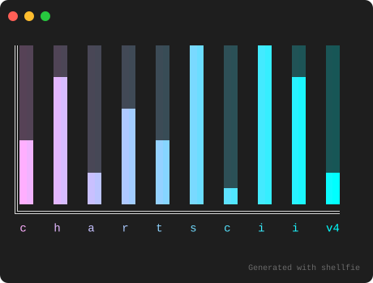

</p>
Transform your data into stunning ASCII bar charts with full color support, stacked bars, vertical layouts, and rich text formatting.

---

# What's New in v4

✅ Stacked charts - create multi value bar charts.  
✅ Label format - full label format control.  
✅ Title - alignment, padding and centering options.  
✅ Bar alignment - justify, center, left/right/top/bottom (depending on orientation).  
✅ Gradient charts - create vertical/horizontal/diagonal gradient charts.  
✅ Fill color - automatically follow gradient/color or separately.  
✅ Relative scaling control - relative and absolute.  
✅ Auto color mode - cycle through colors automatically.  
✅ Animate - create chart animations (using cursor reset).

---

## Installation

```bash
npm install chartscii
```

For CLI usage, see [chartscii-cli](https://github.com/tool3/chartscii-cli).

---

## Quick Start

```typescript
import Chartscii from "chartscii";

const data = Array.from({ length: 10 }, (_, i) => i + 1);
const chart = new Chartscii(data, {
  width: 50,
  theme: "pastel",
  barSize: 2,
  orientation: "vertical",
  color: "pink",
});

console.log(chart.create());
```

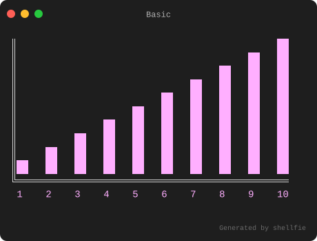

---

## Input Formats

### Simple Numbers

```typescript
const chart = new Chartscii([1, 2, 3, 4, 5]);
```

### Chart Points

```typescript
const data = [
  { label: "Sales", value: 100, color: "green" },
  { label: "Returns", value: 25, color: "red" },
  { label: "Pending", value: 40, color: "yellow" },
];
```

### Stacked Chart Points

```typescript
const data = [ 
  { label: "Jan", value: [25, 25, 50], color: ["green", "yellow", "red"] },
  { label: "Feb", value: [22, 68, 10], color: ["green", "yellow", "red"] },
  { label: "Mar", value: [40, 10, 50], color: ["green", "yellow", "red"] },
];
```

```typescript
const chart = new Chartscii(data, { colorLabels: true, valueLabels: true });
```

| Property | Type                   | Description                         |
| -------- | ---------------------- | ----------------------------------- |
| `label`  | `string`               | Bar label (defaults to value)       |
| `value`  | `number` or `array`    | Bar value or array for stacked bars |
| `color`  | `string` or `string[]` | Bar color or per-segment colors     |

---

## Configuration

<details>
<summary><strong>All Options</strong></summary>

| Option                     | Type                    | Default        | Description                                          |
| -------------------------- | ----------------------- | -------------- | ---------------------------------------------------- |
| `width`                    | `number`                | `100`          | Chart width in characters                            |
| `height`                   | `number`                | `10`           | Chart height in lines                                |
| `padding`                  | `number`                | `0`            | Space between bars                                   |
| `barSize`                  | `number`                | `1`            | Thickness of each bar                                |
| `orientation`              | `string`                | `'horizontal'` | `'horizontal'` or `'vertical'`                       |
| `alignBars`                | `string`                | `'justify'`    | Bar alignment                                        |
| `title`                    | `string \| TitleConfig` | `''`           | Chart title                                          |
| `char`                     | `string`                | `'█'`          | Character used for bars                              |
| `fill`                     | `string`                | —              | Fill character for empty space                       |
| `fillColor`                | `string`                | —              | Fill color or `'auto'`                               |
| `color`                    | `string`                | —              | Bar color, gradient string, or `'auto'`              |
| `theme`                    | `string`                | `''`           | Theme name from styl3                                |
| `naked`                    | `boolean`               | `false`        | Hide borders                                         |
| `labels`                   | `boolean`               | `true`         | Show bar labels                                      |
| `colorLabels`              | `boolean`               | `true`         | Color the labels                                     |
| `valueLabels`              | `boolean`               | `false`        | Show values on bars (segment values for stacked)     |
| `valueLabelsFloatingPoint` | `number`                | —              | Decimal precision                                    |
| `labelFormat`              | `function`              | —              | Custom label formatter                               |
| `valueLabelFormat`         | `(values: string[]) => string` | —       | Custom value label formatter                         |
| `percentage`               | `boolean`               | `false`        | Show percentages                                     |
| `sort`                     | `boolean`               | `false`        | Sort ascending                                       |
| `reverse`                  | `boolean`               | `false`        | Reverse order                                        |
| `scale`                    | `string \| number`      | `'auto'`       | `'auto'`, `'relative'`, `'relative-zero'`, or number |
| `stackColors`              | `string[]`              | —              | Stacked segment colors                               |
| `stackLabels`              | `string[]`              | —              | Stacked segment labels                               |
| `richLabels`               | `boolean`               | `true`         | Enable styl3 rich text decorators in labels           |
| `structure`                | `object`                | —              | Custom border characters                             |

</details>

<details>
<summary><strong>Scaling Modes</strong></summary>

| Mode              | Behavior                                                 |
| ----------------- | -------------------------------------------------------- |
| `'auto'`          | Absolute scaling from 0 to max                           |
| `'relative'`      | Maps `[min, max]` → `[1, size]` — emphasizes differences |
| `'relative-zero'` | Maps `[min, max]` → `[0, size]` — max contrast           |
| `number`          | Fixed scale factor: `value / scale`                      |

</details>

<details>
<summary><strong>Structure Characters</strong></summary>

```typescript
structure: {
  x: '═',        // horizontal axis
  y: '╢',        // tick mark
  axis: '║',     // vertical axis
  topLeft: '╔',  // top-left corner
  bottomLeft: '╚' // bottom-left corner
}
```

</details>

---

## API

```typescript
const chart = new Chartscii(data: InputData[], options?: ChartOptions);
chart.create(); // returns the chart as a string
```

```typescript
type InputData =
  | number
  | {
      value: number | number[] | { value: number; color?: string }[];
      label?: string;
      color?: string | string[];
    };
```

# Examples and features
## Auto Color

Automatically cycle through a curated color palette — no manual color assignments needed.

```typescript
const data = Array.from({ length: 9 }, (_, i) => ({
  value: (i + 1) * 5,
  label: `item ${i + 1}`,
}));

const chart = new Chartscii(data, {
  width: 50,
  color: "auto",
  colorLabels: true,
  valueLabels: true,
  theme: "pastel",
});
```

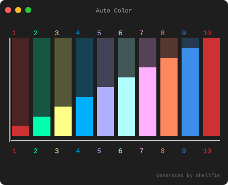

---

## Gradients

Create eye-catching multi-color gradients in any direction.

```typescript
const data = Array.from({ length: 20 }, (_, i) => ({
  value: Math.round(Math.sin(i / 3) * 10 + 15),
  label: `${i}`,
}));

const chart = new Chartscii(data, {
  width: 60,
  title: {
    text: "Gradient Aligned Right",
    align: "right",
    color: "gradient",
    padding: [1, 0],
  },
  orientation: "vertical",
  color: "gradient(pink,cyan)",
  theme: "beach",
  fill: "░",
  fillColor: "auto",
  padding: 1,
  valueLabels: true,
});
```

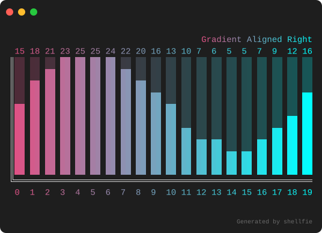

<!-- SHELLFIE: gradient_wave -->

### Gradient Directions

```typescript
// Horizontal — left to right
color: "gradient(red,yellow,green)";

// Vertical — top to bottom
color: "gradient(purple,cyan:vertical)";

// Diagonal — corner to corner
color: "gradient(pink,orange,yellow:diagonal)";

// All gradients can be reversed for opposite direction gradient
color: "gradient(purple,cyan:vertical:reverse)";
color: "gradient(pink,orange,yellow:diagonal:reverse)";
color: "gradient(purple,cyan:vertical:reverse)";
```

```typescript
const chart = new Chartscii(data, {
    orientation: 'vertical',
    barSize: 10,
    sort: false,
    fill: '▒',
    fillColor: 'auto',
    colorLabels: true,
    color: 'gradient(pink,cyan:reverse)',
    theme: 'pinkish',
    percentage: true,
    labels: true
});

```

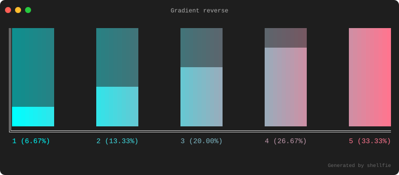

---

## Stacked Bars

Visualize multi-dimensional data with stacked segments.

```typescript
const data: InputData[] = [
  { label: "Mon", value: [5, 10, 5] },
  { label: "Tue", value: [7, 3, 10] },
  { label: "Wed", value: [10, 6, 4] },
  { label: "Thu", value: [3, 6, 11] },
  { label: "Fri", value: [8, 6, 6] },
  { label: "Sat", value: [11, 5, 6] },
  { label: "Sun", value: [9, 6, 5] },
];
const chart = new Chartscii(data, {
  height: 10,
  barSize: 1,
  width: 50,
  padding: 5,
  theme: "pastel",
  alignBars: "justify",
  orientation: "vertical",
  stackColors: ["red", "orange", "yellow"],
});
```

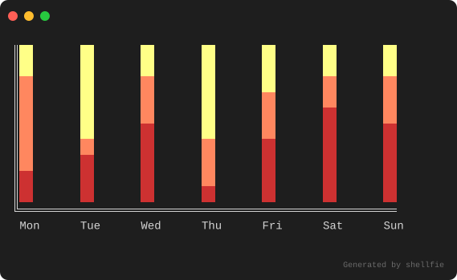

### Vertical Horizontal

```typescript
const chart = new Chartscii(data, {
  barSize: 2,
  width: 60,
  padding: 1,
  theme: "pastel",
  alignBars: "justify",
  colorLabels: true,
  color: "green",
  stackColors: ["green", "pink", "blue"],
});
```

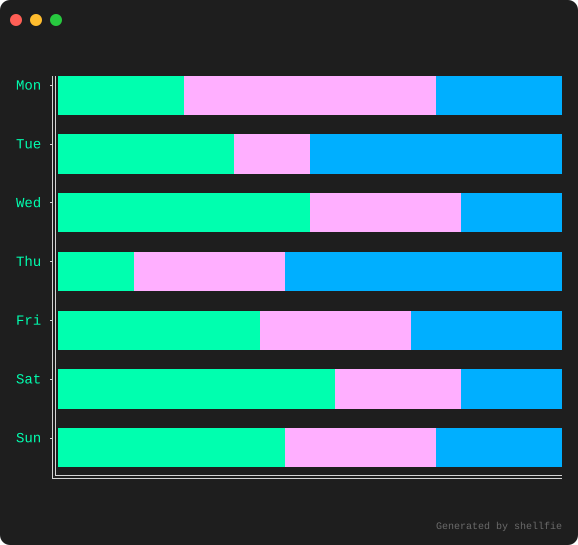

## Auto stacked
Stacked charts also support auto colors.

```typescript
const chart = new Chartscii(data, {
 ...
  color: "auto",
  ...
});
```

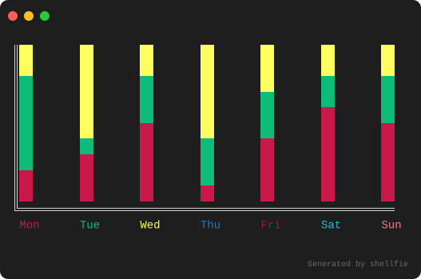

And partial overrides

```typescript
const data: InputData[] = [
  ...
  { label: 'Thu', value: [3, 6, 11], color: ['cyan', 'pink', 'purple'] },
  ...
];
```

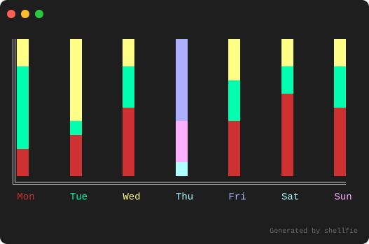

---

## Themes

Chartscii integrates with [styl3](https://github.com/tool3/styl3) for 20+ built-in color themes.

```typescript
// Just set the theme name
const chart = new Chartscii(data, { theme: "lush" });
```

| Theme    | Vibe                  |
| -------- | --------------------- |
| `pastel` | Soft, muted tones     |
| `lush`   | Vibrant, saturated    |
| `beach`  | Warm coastal palette  |
| `neon`   | Electric, bright      |
| `sunset` | Warm orange/red tones |
| `nature` | Earthy greens         |
| `mint`   | Cool mint/teal        |

See all themes in [styl3 docs](https://github.com/tool3/styl3/tree/master?tab=readme-ov-file#themes).

<!-- SHELLFIE: themes_showcase (same data rendered with 4 different themes in a 2x2 grid) -->

---

## Label Formatting

Full control over labels with custom format functions and rich text via [styl3](https://github.com/tool3/styl3).

```typescript
const data = Array.from({ length: 10 }, (_, i) => i + 1);
const chart = new Chartscii(data, {
  fill: "░",
  labelFormat: (label) => `\x1b[7mlabel ${label}`,
  fillColor: "auto",
  padding: 1,
  theme: "beach",
  valueLabels: true,
  orientation: "vertical",
  color: "gradient(lime,purple)",
});
```

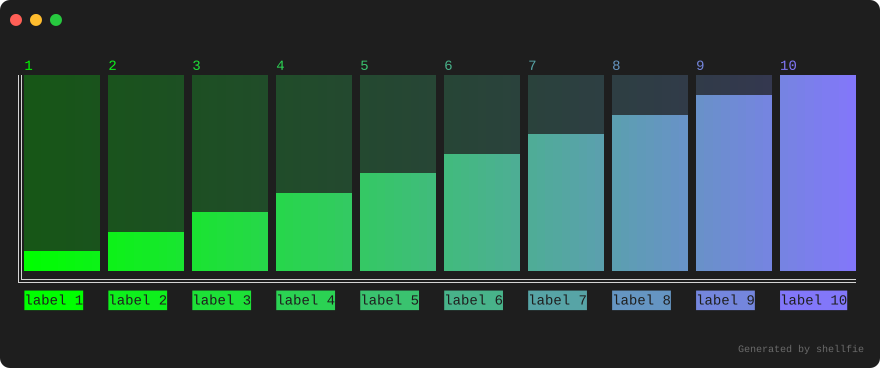

### Rich Text Labels

```typescript
const data = [
  { value: 10, label: "*bold* Sales", color: "green" },
  { value: 5, label: "%italic% Returns", color: "red" },
  { value: 8, label: "!underline! Pending", color: "yellow" },
  { value: 3, label: "@invert@ Cancelled", color: "purple" },
];

const chart = new Chartscii(data, {
  barSize: 16,
  theme: "pastel",
  alignBars: "justify",
  orientation: "vertical",
  stackColors: ["red", "orange", "yellow"],
});
```

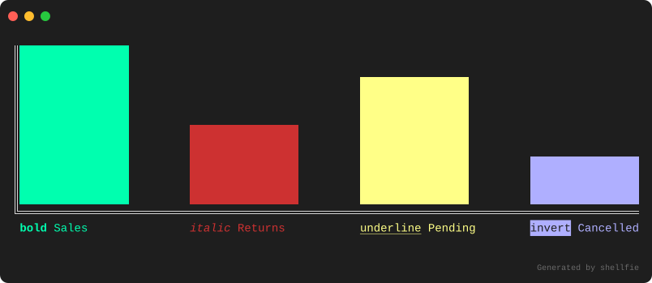

---

## Orientation & Alignment

### Horizontal

```typescript
const chart = new Chartscii(data, {
  width: 80,
  padding: 1,
  barSize: 1,
  color: "auto",
  theme: "beach",
  alignBars: "center", // 'top' | 'center' | 'bottom' | 'justify'
});
```

| top                              | bottom                              | center                              | justify                              |
| -------------------------------- | ----------------------------------- | ----------------------------------- | ------------------------------------ |
| 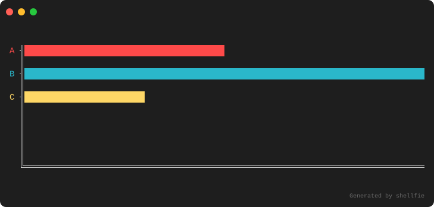 | 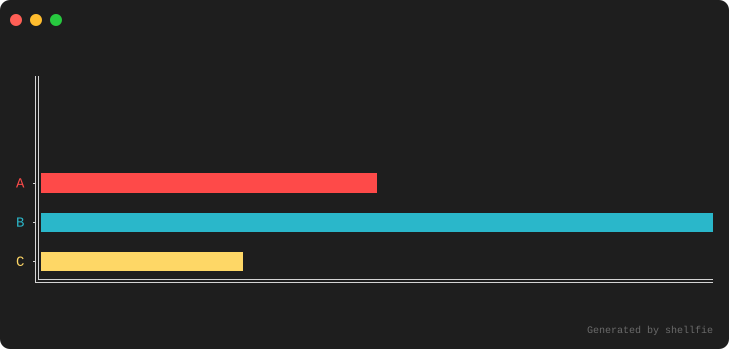 | 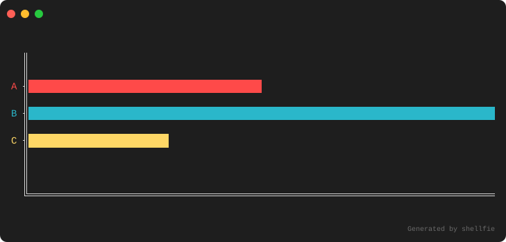 | 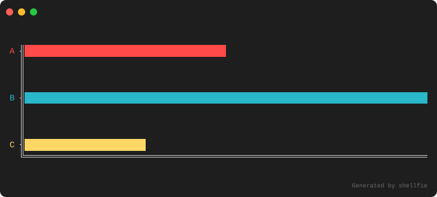 |

### Vertical

```typescript
const chart = new Chartscii(data, {
  orientation: 'vertical'
  width: 80,
  padding: 1,
  barSize: 1,
  color: "auto",
  theme: "beach",
  alignBars: "justify", // 'left' | 'center' | 'right' | 'justify'
});
```

| left                                | right                                | center                                | justify                                |
| ----------------------------------- | ------------------------------------ | ------------------------------------- | -------------------------------------- |
| 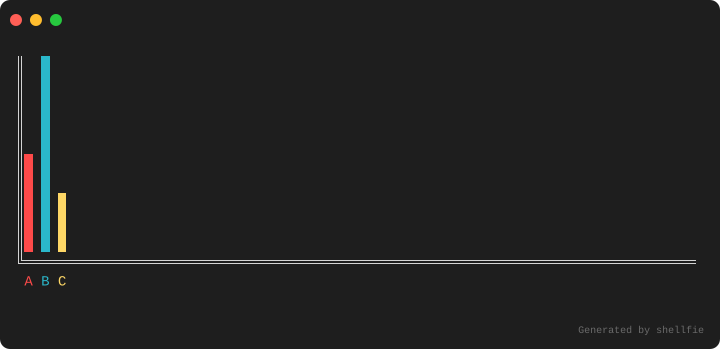 | 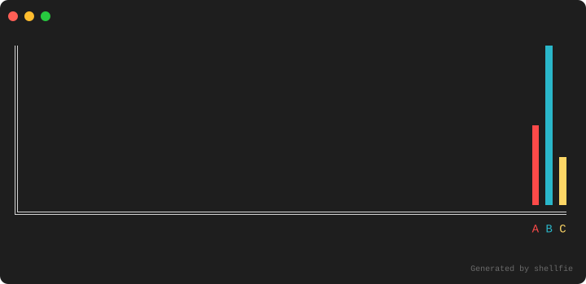 | 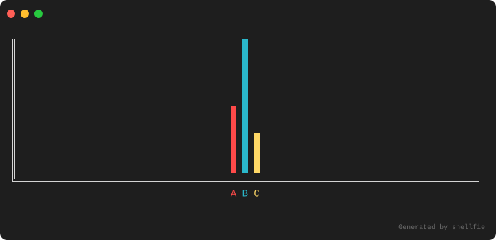 | 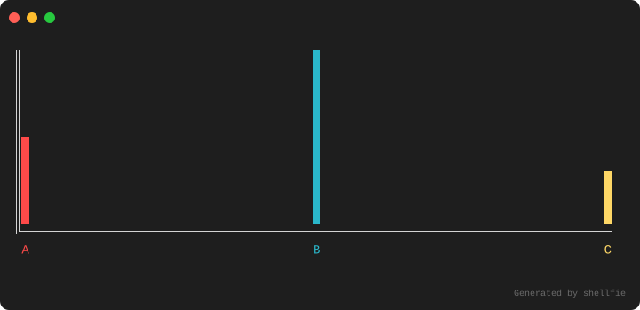 |

---

## Animation

Create smooth terminal animations with easing support.

```typescript
const data = Array.from({ length: 20 }, (_, i) => ({
  value: Math.round(Math.sin(i / 3) * 10 + 15),
  label: `${i}`,
}));

const chart = new Chartscii(data, {
  width: 60,
  title: {
    text: "Gradient Aligned Center",
    align: "center",
    color: "gradient",
  },
  orientation: "vertical",
  color: "gradient(pink,cyan)",
  theme: "beach",
  fill: "░",
  padding: 1,
  fillColor: "auto",
  valueLabelsFloatingPoint: 0,
  valueLabels: true,
});

chart.animate({ duration: 1500, easing: "easeInOut", fps: 60 });
```



---

### Sine Wave

```typescript
const frames = 120;
for (let frame = 0; frame < frames; frame++) {
  const data = Array.from({ length: 40 }, (_, i) => {
    const value = Math.sin((i + frame) / 4) * 10 + 12;
    return { value: Math.round(value), label: "" };
  });

  const chart = new Chartscii(data, {
    orientation: "vertical",
    height: 24,
    naked: true,
    labels: false,
    color: "gradient(cyan,purple,pink:vertical)",
    fill: "░",
    fillColor: "auto",
  });

  process.stdout.write("\x1B[H" + chart.create());
}
```


---

## Contributing

Contributions are welcome! Please feel free to submit a Pull Request.

## License

MIT © [tool3](https://github.com/tool3)

---
