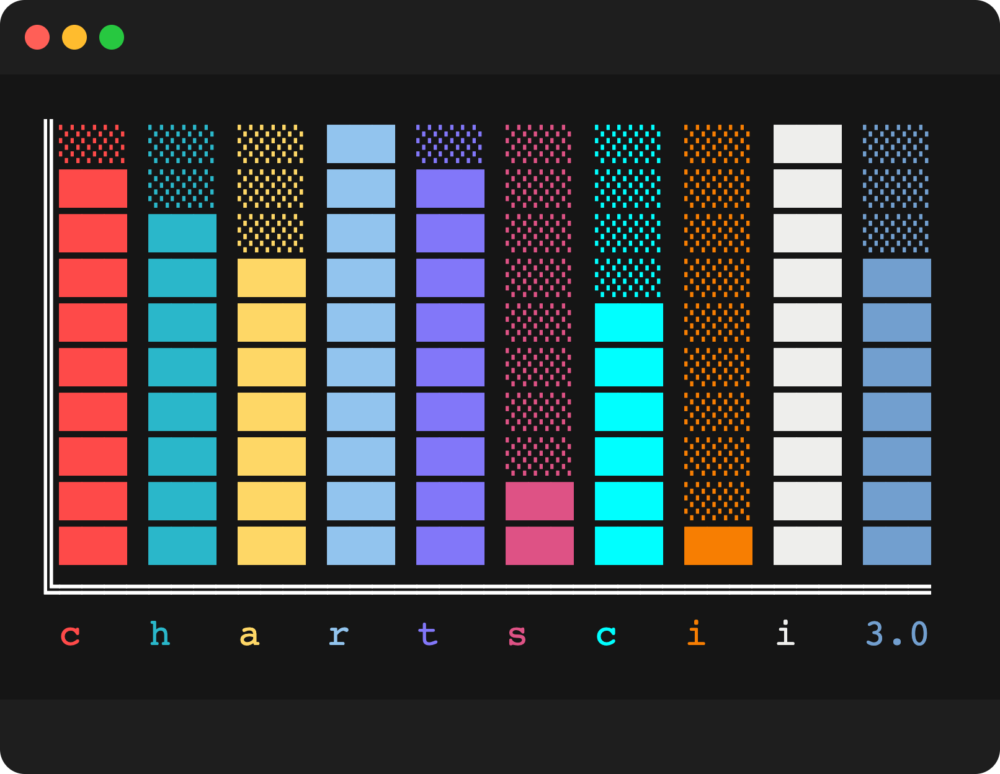

# Chartscii 3.0!



[](https://github.com/tool3/shellfie)

for command line usage see: [chartscii-cli](https://github.com/tool3/chartscii-cli)

Chartscii was rewritten from scratch in TypeScript!
It includes many new features, improvements and rich formatting capabilities.

# What’s new

✅ Full width and height control.  
✅ New `padding` and `barSize` options!  
✅ New `orientation` option! vertical charts are here!  
✅ New rich styl3 formatting support!  
✅ New Emoji characters support! [\*](#unicode-issues)

# install

```bash
npm install chartscii
```

# usage

`chartscii` accepts an array of data objects, with optional labels, and outputs an ascii bar chart.

## usage example

```typescript
import Chartscii from "chartscii";

const data = [1, 2, 3, 4, 5, 6, 7, 8, 9, 10];
const options = {
  title: "chartscii",
  width: 50,
  theme: "pastel",
  color: "pink",
  colorLabels: true,
  barSize: 2,
  orientation: "vertical"
};
const chart = new Chartscii(data, options);
console.log(char.create());
```


# Input

Chartscii accepts an array of data points to draw the chart.

This can be an array of numbers, or an array of chart points as explained below.

## number[]

If you provide an array of numbers, chartscii will draw each bar using the provided values.

Value is scaled to width/height of chart, depending on the orientation option.

### example

```tsx
import Chartscii from "chartscii";

const data = [1, 2, 3, 4, 5, 6, 7, 8, 9, 10];
const chart = new Chartscii(data);
console.log(chart.create());
```


## ChartPoint[]

For maximum flexibility, provide an array of chart points. This will allow you to customize the following properties:

| name  | description | type   | default       |
| ----- | ----------- | ------ | ------------- |
| label | bar label   | string | point.value   |
| value | bar value   | number | N/A           |
| color | bar color   | string | options.color |

### example

```tsx
import Chartscii from "chartscii";

const data = [
  { label: "label", value: 2, color: "pink" },
  { label: "label", value: 2, color: "purple" },
  { label: "label", value: 2, color: "marine" }
];
const chart = new Chartscii(data, { colorLabels: true, valueLabels: true });
console.log(chart.create());
```


# Options

You can customize the look and size of the chart, as well as rich formatting for labels provided by `styl3`.

## default options

Chartscii accepts customization options as a second argument and will merge the provided options with the following one:

```tsx
const options: ChartOptions = {
  percentage: false,
  colorLabels: false,
  sort: false,
  reverse: false,
  naked: false,
  labels: true,
  color: undefined,
  fill: undefined,
  width: 100,
  height: 10,
  padding: 0,
  barSize: 1,
  title: "",
  char: "█",
  orientation: "horizontal",
  theme: "",
  structure: {
    x: "═",
    y: "╢",
    axis: "║",
    topLeft: "╔",
    bottomLeft: "╚"
  }
};
```

## customization options

| name                     | description                                                                                                 | type                 | default                                                        |
| ------------------------ | ----------------------------------------------------------------------------------------------------------- | -------------------- | -------------------------------------------------------------- |
| percentage               | calculate and show percentage data                                                                          | `boolean`            | `false`                                                        |
| colorLabels              | color labels with provided color per label, or color provided to option                                     | `boolean`            | `false`                                                        |
| valueLabels              | show values of each bar                                                                                     | `boolean`            | `false`                                                        |
| valueLabelsPrefix        | prefix for the value labels (for example to be used with currency)                                          | `string`             | `undefined`                                                    |
| valueLabelsFloatingPoint | sets decimal place precision for value labels; defaults to printing entire number, excluding extra zeroes   | `number`             | `undefined`                                                    |
| sort                     | sort the input data                                                                                         | `boolean`            | `false`                                                        |
| reverse                  | reverse the input data                                                                                      | `boolean`            | `false`                                                        |
| naked                    | don’t print chart structure ascii characters                                                                | `boolean`            | `false`                                                        |
| labels                   | show labels                                                                                                 | `boolean`            | `true`                                                         |
| color                    | fallback color or unified char bars color                                                                   | `string`             | `undefined`                                                    |
| fill                     | use this character to fill remaining chart bar space                                                        | `string`             | `undefined`                                                    |
| scale                    | values are scaled proportionate to this value. otherwise the max will be calculated from the provided data. | `number` or `string` | `auto`                                                         |
| width                    | width of chart                                                                                              | `number`             | `100`                                                          |
| height                   | height of chart                                                                                             | `number`             | `10`                                                           |
| padding                  | padding between bars                                                                                        | `number`             | `0`                                                            |
| barSize                  | size of each bar                                                                                            | `number`             | `1`                                                            |
| title                    | chart title                                                                                                 | `string`             | `undefined`                                                    |
| char                     | use this character to draw the chart bars                                                                   | `string`             | `█`                                                            |
| orientation              | horizontal or vertical                                                                                      | `string`             | `horizontal`                                                   |
| theme                    | `styl3`'s [themes](https://github.com/tool3/styl3?tab=readme-ov-file#themes)                                | `string`             | `undefined`                                                    |
| structure                | use these characters to draw the enclosing chart borders.                                                   | `object`             | `{ x: '═', y: '╢', bottomLeft: '╚', axis: '║', topLeft: '╔' }` |

## chartscii + styl3 = ❤️

You can use `styl3`’s [formatting](https://github.com/tool3/styl3?tab=readme-ov-file#map) for cool themes, built-in color names and rich label formatting.

You should check out `styl3` for a full list of customization options.

### example

```tsx
const colors = [
  "red",
  "green",
  "yellow",
  "blue",
  "purple",
  "pink",
  "cyan",
  "orange"
];

const data = [];
for (let i = 0; i < colors.length; i++) {
  const color = colors[i];
  data.push({ value: i + 1, color, label: `@invert ${i}@`, theme: "pastel" });
}

const chart = new Chartscii(data, {
  fill: "░",
  colorLabels: true,
  orientation: "vertical"
});

console.log(chart.create());
```


# examples

here are some examples of charts using `styl3`'s formatting on the chart labels.

> [!TIP]  
> you can run more examples from the `./examples/` directory of this repository using `ts-node`.  
> for example `npx ts-node examples/loaders.ts`

## vertical

| options                                                                     | chart                                                                            |
| --------------------------------------------------------------------------- | -------------------------------------------------------------------------------- |
| beach theme with italic and bold labels with a bar size of 2                |                 |
| pastel theme with bold and underlined labels with padding of 2              |             |
| lush theme with strikedout labels no padding and emoji                      |                      |
| lush theme with underlined labels no padding and no axis structure char     |          |
| standard theme with dimmed and italic labels and padding 1                  |  |
| pastel theme with inverted and underlined labels with a dark fill character |       |

## horizontal

| options                                                               | chart                                                               |
| --------------------------------------------------------------------- | ------------------------------------------------------------------- |
| pastel theme with bold labels and percentage                          |     |
| lush theme with inverted labels and naked chart                       |   |
| beach theme with underlined labels and different structure characters |  |
| pastel theme with padding of 1 and custom char                        |                |
| pastel theme with naked chart to create multiple loaders              |                    |

# Unicode issues

Unfortunately, there are some known issues with specific unicode characters width.  
This means that some emoji/unicode characters renders as 2 characters wide (or more) instead of 1, which is not a problem in itself.  
The problem is that Javscript determines this length as 1, which creates an issue with label alignment, or drawing the chart bars correctly.

> [!WARNING]  
> If you have issues with label alignment, or the chart bars aren't spaced correctly - you are probably using an emoji/unicode character which produce the wrong width in javascript.

If you encounter this issue unfortunately the current solution is to simply use a different emoji.  
(For example: 🔥 works well while ✅ will result in a misaligned chart).  
PRs for this problem are more than welcome.
