# Chartscii
Beautiful ASCII charts for your terminal


Transform your data into stunning ASCII bar charts with full color support, stacked bars, vertical layouts, and rich text formatting.

---

# What's New in v4

✅ Stacked charts - create multi value bar charts.    
✅ Label format - full label format control.    
✅ Title - alignment, padding and centering options.    
✅ Bar alignment - justify, center, left/right/top/bottom (depending on orientation).   
✅ Gradient charts - create vertical/horizontal/diagonal gradient charts.      
✅ Fill color - automatically follow gradient/color or separately.      
✅ Relative scaling control - relative and absoslute.   
✅ Auto color mode - cycle through colors automatically.   
✅ Animate - create scaling animations (using cursor reset animation).   

---

## Installation

```bash
npm install chartscii
```

For CLI usage, see [chartscii-cli](https://github.com/tool3/chartscii-cli).

---

## Quick Start

```typescript
import Chartscii from 'chartscii';

const data = Array.from({ length: 10 }, (_, i) => i + 1);
const chart = new Chartscii(data, {
  width: 50,
  theme: 'pastel',
  barSize: 2,
  orientation: 'vertical',
  color: 'pink'
});

console.log(chart.create());
```


---

## Input Formats

Chartscii accepts flexible input formats to suit your needs.

### Simple Numbers

```typescript
const data = [1, 2, 3, 4, 5];
const chart = new Chartscii(data);
```

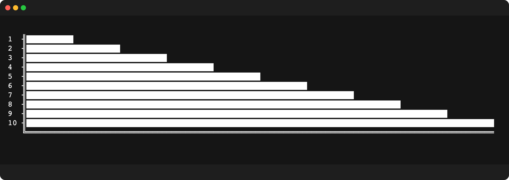

### Chart Points

For full control, provide an array of chart point objects:

```typescript
const data = [
  { label: 'Sales', value: 100, color: 'green' },
  { label: 'Returns', value: 25, color: 'red' },
  { label: 'Pending', value: 40, color: 'yellow' }
];

const chart = new Chartscii(data, { colorLabels: true, valueLabels: true });
```

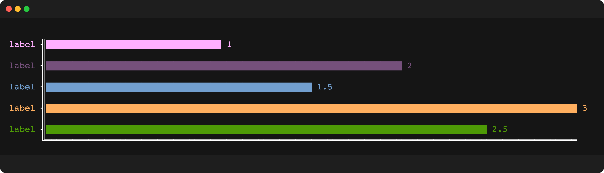

| Property | Type | Description |
|----------|------|-------------|
| `label` | `string` | Bar label (defaults to value) |
| `value` | `number` or `array` | Bar value or array for stacked bars |
| `color` | `string` or `string[]` | Bar color or per-segment colors for stacked bars |

---

## Stacked Bar Charts

Create multi-segment bars by providing an array of values. Stacked bars work in both horizontal and vertical orientations.

### Basic Stacked Bars

```typescript
const data = [
  { label: 'Q1', value: [10, 20, 5] },
  { label: 'Q2', value: [15, 10, 10] },
  { label: 'Q3', value: [8, 15, 12] }
];

const chart = new Chartscii(data, {
  width: 60,
  stackColors: ['green', 'yellow', 'red'],
  fill: '░'
});

console.log(chart.create());
```

### Stacked Bars with Per-Segment Colors

```typescript
const data = [
  {
    label: 'Revenue',
    value: [
      { value: 100, color: 'blue' },
      { value: 50, color: 'cyan' },
      { value: 30, color: 'marine' }
    ]
  }
];

const chart = new Chartscii(data, {
  width: 80,
  stackValueLabels: true  // Show individual segment values
});
```

### Per-Bar Color Override

Override segment colors for individual bars using a `color` array. This allows mixing custom colors with global `stackColors`:

```typescript
const data = [
  { label: 'default', value: [5, 12, 3] },                              // uses stackColors
  { label: 'custom', value: [5, 12, 3], color: ['red', 'blue', 'green'] }, // full override
  { label: 'partial', value: [5, 12, 3], color: ['white'] }             // first segment white, rest use stackColors
];

const chart = new Chartscii(data, {
  width: 50,
  stackColors: ['green', 'yellow', 'red']  // default colors for all bars
});
```

**Color Priority (highest to lowest):**
1. Segment object color: `{ value: 10, color: 'blue' }`
2. Per-bar color array: `{ value: [1,2,3], color: ['red', 'green', 'blue'] }`
3. Global `stackColors` option
4. Global `color` option (fallback)

### Vertical Stacked Bars

```typescript
const data = [
  { label: 'Jan', value: [5, 10, 3] },
  { label: 'Feb', value: [7, 8, 5] },
  { label: 'Mar', value: [10, 3, 5] }
];

const chart = new Chartscii(data, {
  orientation: 'vertical',
  height: 15,
  stackColors: ['red', 'orange', 'yellow'],
  alignBars: 'center',
  padding: 2
});
```

---

## Chart Orientation

### Horizontal (Default)

```typescript
const chart = new Chartscii(data, {
  orientation: 'horizontal',
  width: 80,
  alignBars: 'center'  // 'top' | 'center' | 'bottom' | 'justify'
});
```

### Vertical

```typescript
const chart = new Chartscii(data, {
  orientation: 'vertical',
  height: 20,
  barSize: 2,
  alignBars: 'justify'  // 'left' | 'center' | 'right' | 'justify'
});
```

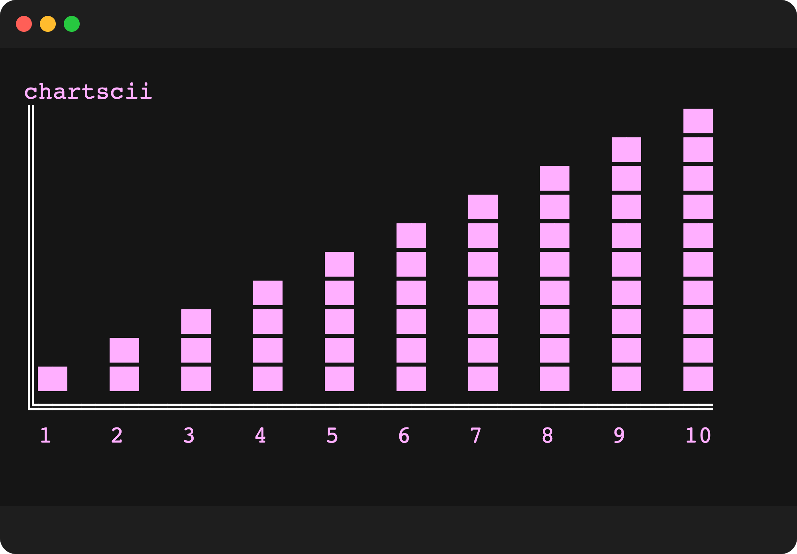

---

## Configuration Options

### All Options

```typescript
const options = {
  // Layout
  width: 100,              // Chart width
  height: 10,              // Chart height
  padding: 0,              // Space between bars
  barSize: 1,              // Thickness of each bar
  orientation: 'horizontal', // 'horizontal' | 'vertical'
  alignBars: 'justify',    // Bar alignment within chart

  // Appearance
  title: '',               // Chart title
  char: '█',               // Bar character
  fill: undefined,         // Fill character for empty space
  fillColor: undefined,    // Color for fill character
  color: undefined,        // Default bar color
  theme: '',               // 'pastel' | 'lush' | 'beach' | 'standard'
  naked: false,            // Hide border characters

  // Labels
  labels: true,            // Show labels
  colorLabels: false,      // Color the labels
  valueLabels: false,      // Show values on bars
  valueLabelsFloatingPoint: undefined,  // Decimal precision
  labelFormat: undefined,  // Format function for labels
  valueLabelFormat: undefined,  // Format function for value labels

  // Data
  percentage: false,       // Show percentages
  sort: false,             // Sort data ascending
  reverse: false,          // Reverse data order
  scale: 'auto',           // Scale factor or 'auto'

  // Stacked bars
  stackColors: undefined,  // Colors for each segment
  stackLabels: undefined,  // Labels for segments
  stackValueLabels: false, // Show individual segment values

  // Structure characters
  structure: {
    x: '═',
    y: '╢',
    axis: '║',
    topLeft: '╔',
    bottomLeft: '╚'
  }
};
```

### Options Reference

| Option | Type | Default | Description |
|--------|------|---------|-------------|
| `width` | `number` | `100` | Chart width in characters |
| `height` | `number` | `10` | Chart height in lines |
| `padding` | `number` | `0` | Space between bars |
| `barSize` | `number` | `1` | Thickness of each bar |
| `orientation` | `string` | `'horizontal'` | Chart orientation |
| `alignBars` | `string` | `'justify'` | Bar alignment |
| `title` | `string` | `''` | Chart title |
| `char` | `string` | `'█'` | Character used for bars |
| `fill` | `string` | `undefined` | Fill character for empty space |
| `fillColor` | `string` | `undefined` | Color for fill character |
| `color` | `string` | `undefined` | Default bar color |
| `theme` | `string` | `''` | Color theme name |
| `naked` | `boolean` | `false` | Hide border/structure |
| `labels` | `boolean` | `true` | Show bar labels |
| `colorLabels` | `boolean` | `false` | Color the labels |
| `valueLabels` | `boolean` | `false` | Show values on bars |
| `valueLabelsFloatingPoint` | `number` | `undefined` | Decimal precision |
| `labelFormat` | `(label: string) => string` | `undefined` | Format function for labels |
| `valueLabelFormat` | `(value: string) => string` | `undefined` | Format function for value labels |
| `percentage` | `boolean` | `false` | Show percentage values |
| `sort` | `boolean` | `false` | Sort data ascending |
| `reverse` | `boolean` | `false` | Reverse data order |
| `scale` | `'auto'\|'relative'\|'relative-zero'\|number` | `'auto'` | Scale mode (see [Scaling Modes](#scaling-modes)) |
| `stackColors` | `string[]` | `undefined` | Colors for stacked segments |
| `stackLabels` | `string[]` | `undefined` | Labels for stacked segments |
| `stackValueLabels` | `boolean` | `false` | Show segment values |
| `structure` | `object` | See above | Border characters |

---

## Scaling Modes

The `scale` option controls how bar lengths are calculated relative to your data values. This is particularly useful when your data has a narrow range or when you want to emphasize differences between values.

### `'auto'` (Default)

Absolute scaling from 0 to the maximum value. Each bar's length is proportional to its value relative to the maximum.

```typescript
const data = [100, 200, 300];
const chart = new Chartscii(data, { scale: 'auto', width: 30 });
// 100 → 10 chars (1/3 of max)
// 200 → 20 chars (2/3 of max)
// 300 → 30 chars (full width)
```

### `'relative'`

Relative scaling with a baseline. The minimum value displays a small bar, and differences between values are emphasized. Maps your data range `[min, max]` to `[1, size]`.

```typescript
const data = [98, 99, 100];
const chart = new Chartscii(data, { scale: 'relative', width: 30 });
// 98  → 10 chars (small baseline bar)
// 99  → 20 chars (middle)
// 100 → 30 chars (full width)
```

Use `'relative'` when:
- Your values are clustered in a narrow range (e.g., 95-100)
- You want to emphasize small differences between values
- The minimum value should still be visible

### `'relative-zero'`

Relative scaling without a baseline. The minimum value displays no bar (zero length), maximizing the visual difference between values. Maps your data range `[min, max]` to `[0, size]`.

```typescript
const data = [98, 99, 100];
const chart = new Chartscii(data, { scale: 'relative-zero', width: 30 });
// 98  → 0 chars (no bar)
// 99  → 15 chars (middle)
// 100 → 30 chars (full width)
```

Use `'relative-zero'` when:
- You want maximum visual contrast between values
- The absolute value of the minimum isn't important
- Comparing relative differences is the priority

### Numeric Scale

Provide a number to set a fixed scale factor. The bar length is calculated as `value / scale`, capped at the chart size.

```typescript
const data = [50, 100, 150];
const chart = new Chartscii(data, { scale: 5, width: 50 });
// 50  → 10 chars (50 / 5)
// 100 → 20 chars (100 / 5)
// 150 → 30 chars (150 / 5)
```

Use a numeric scale when:
- You need consistent scaling across multiple charts
- You want precise control over bar lengths
- Comparing charts with different data ranges

---

## Theming with styl3

Chartscii integrates with [styl3](https://github.com/tool3/styl3) for rich text formatting and themes.

### Built-in Themes

see 15+ more themes in styl3's [themes](https://github.com/tool3/styl3/tree/master?tab=readme-ov-file#themes).

- `pastel` — Soft, muted colors
- `lush` — Vibrant, saturated colors
- `beach` — Warm, coastal palette
- `standard` — Classic terminal colors

### Rich Label Formatting

Use styl3's formatting syntax in your labels:

```typescript
const data = [
  { value: 10, label: '*bold* Sales', color: 'green' },
  { value: 5, label: '%italic% Returns', color: 'red' },
  { value: 8, label: '!underline! Pending', color: 'yellow' },
  { value: 3, label: '@invert@ Cancelled', color: 'purple' }
  { value: 7, label: '!%*combined*%! Cancelled', color: 'pink' }
];

const chart = new Chartscii(data, {
  theme: 'pastel',
  colorLabels: true
});
```

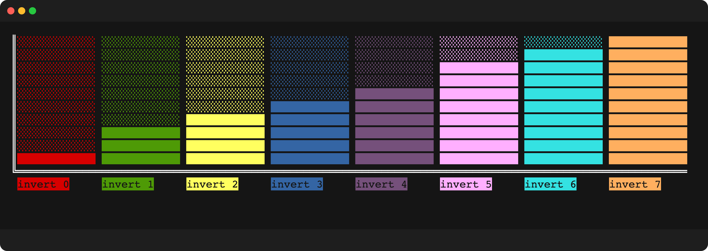

### Available Colors

```
red, green, yellow, blue, purple, pink, cyan, orange,
marine, white, black, grey, and more...
```

---

## Examples

### Progress Bars / Loaders

```typescript
const chart = new Chartscii([
  { value: 75, label: 'Loading...' }
], {
  width: 40,
  naked: true,
  fill: '░',
  color: 'green',
  theme: 'pastel'
});
```

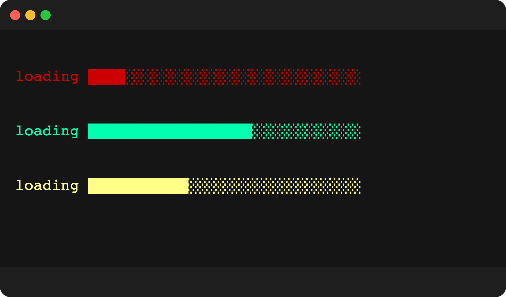

### Percentage Display

```typescript
const chart = new Chartscii(data, {
  percentage: true,
  colorLabels: true,
  theme: 'pastel'
});
```

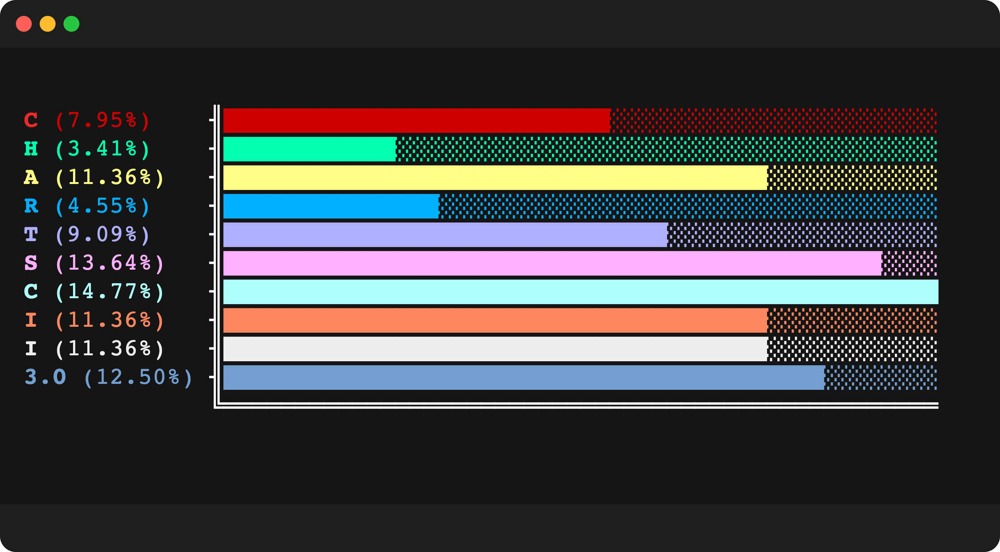

### Custom Structure Characters

```typescript
const chart = new Chartscii(data, {
  structure: {
    x: '─',
    y: '│',
    axis: '│',
    topLeft: '┌',
    bottomLeft: '└'
  }
});
```

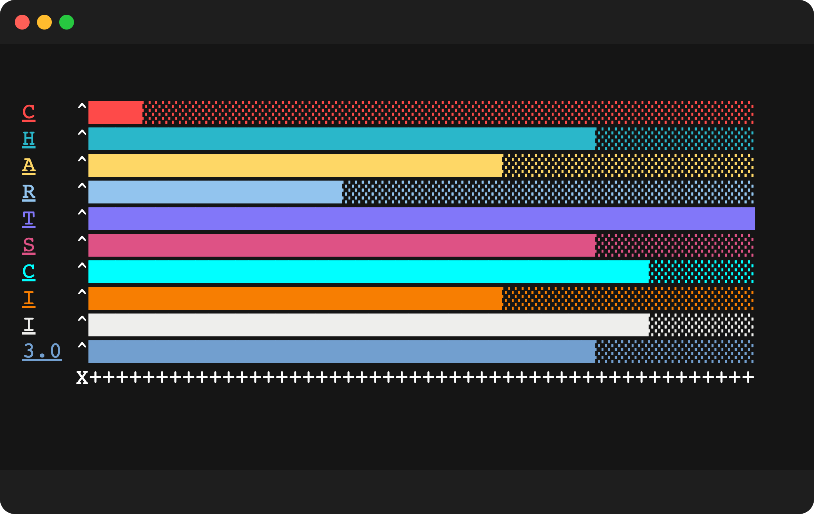

### Currency Values

```typescript
const chart = new Chartscii([
  { label: 'Product A', value: 1250.50 },
  { label: 'Product B', value: 890.25 },
  { label: 'Product C', value: 2100.00 }
], {
  valueLabels: true,
  valueLabelFormat: (v) => `$${v}`,
  valueLabelsFloatingPoint: 2
});
```

---

## Gallery

### Vertical Charts

| Description | Preview |
|-------------|---------|
| Beach theme, italic/bold labels, barSize: 2 | 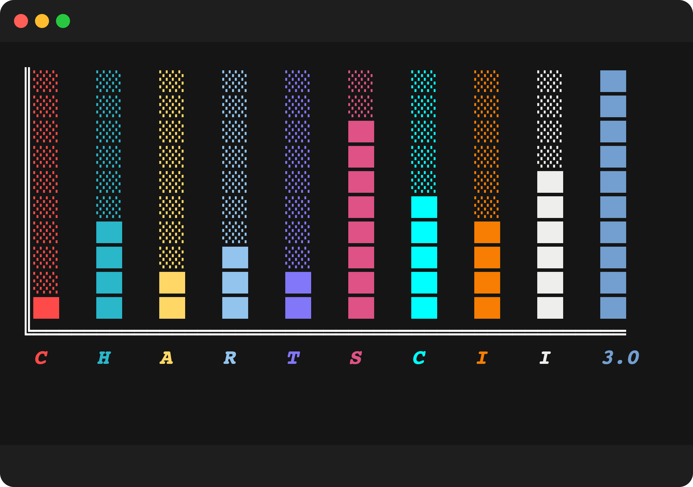 |
| Pastel theme, bold/underline labels, padding: 2 | 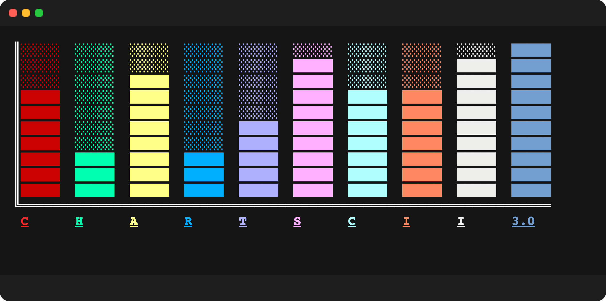 |
| Lush theme, strikeout labels, emoji chars | 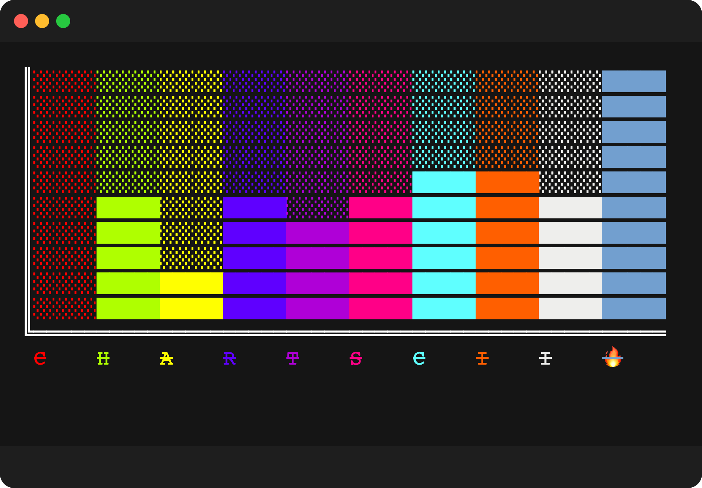 |
| Pastel theme, inverted labels, dark fill | 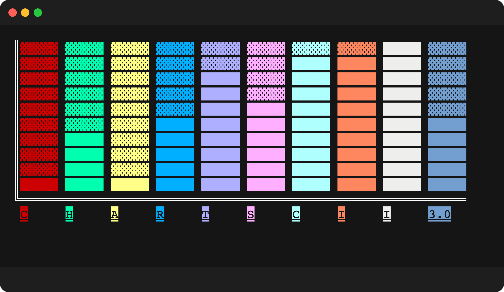 |

### Horizontal Charts

| Description | Preview |
|-------------|---------|
| Pastel theme, bold labels, percentage |  |
| Lush theme, inverted labels, naked | 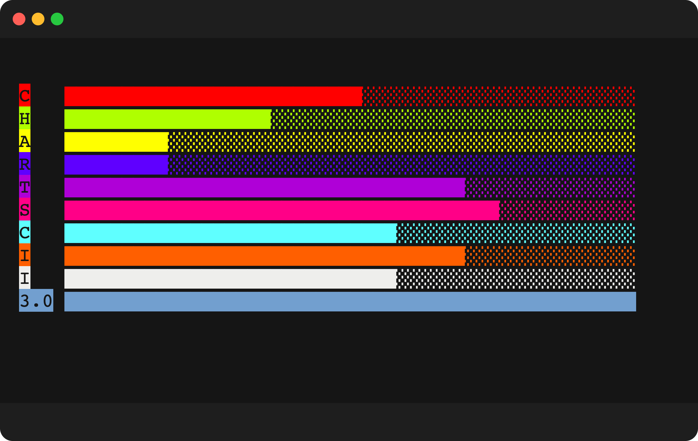 |
| Beach theme, underline labels, custom structure |  |
| Pastel theme, custom char, padding | 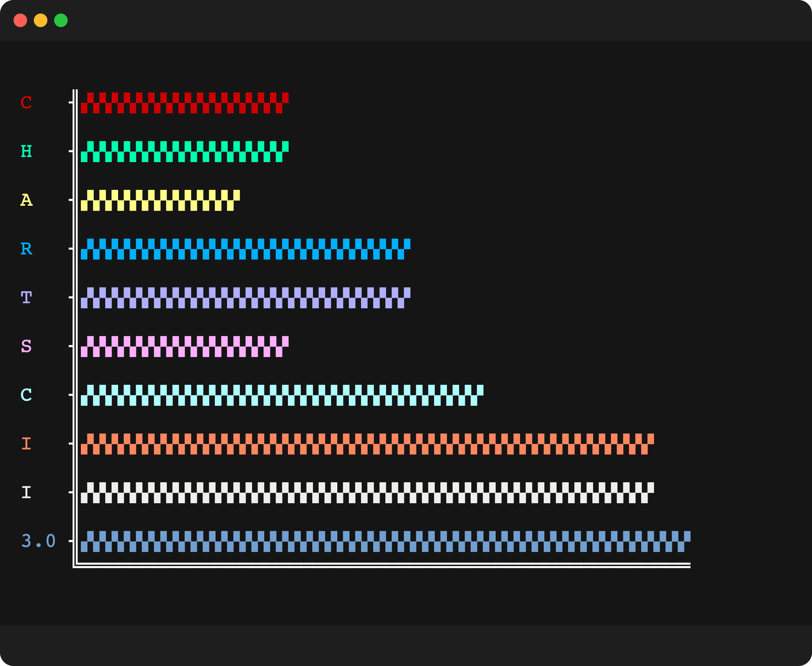 |

---

## API

### Constructor

```typescript
const chart = new Chartscii(data: InputData[], options?: ChartOptions);
```

### Methods

| Method | Returns | Description |
|--------|---------|-------------|
| `create()` | `string` | Generate and return the chart as a string |

### Types

```typescript
type InputData = number | {
  value: number | StackedValue;
  label?: string;
  color?: string | string[];  // string[] for per-segment colors in stacked bars
};

type StackedValue = number[] | { value: number; color?: string }[];
```

---

## Unicode Notes

Some emoji/unicode characters render as 2+ characters wide but JavaScript reports their length as 1. This can cause alignment issues.

> **Tip:** If you experience alignment issues, try a different emoji. For example, 🔥 works well while ✅ may cause misalignment.

---

## Running Examples

```bash
npx ts-node examples/simple.ts
npx ts-node examples/fancy.ts
npx ts-node examples/loaders.ts
```

---

## Contributing

Contributions are welcome! Please feel free to submit a Pull Request.

---

## License

MIT © [tool3](https://github.com/tool3)

---

<p align="center">
  Made with ❤️ and ASCII art
</p>


npx ts-node examples/sine.ts | npx ts-node ../dvd-cli/src/cli.ts -o bbb.svg -t "chartscii sine wave" --watermark "made with dvd" --playbackSpeed 2 -p -1 --background "gradient(#d2a8ff,cyan:horizontal)" --background-padding 20