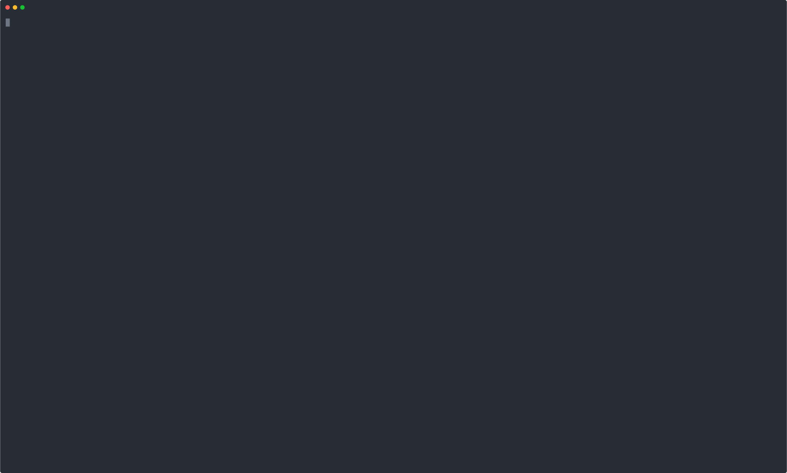
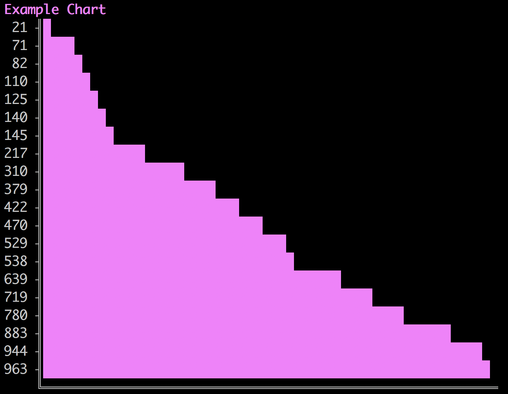
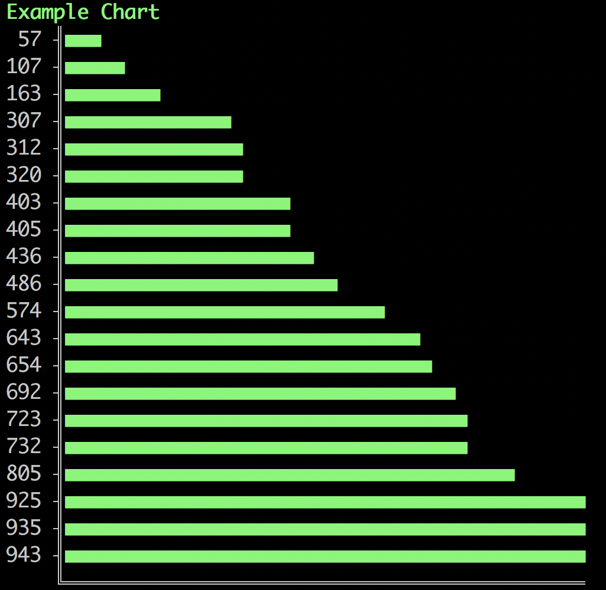

# chartscii
[](https://travis-ci.org/tool3/chartscii)    
simple ascii bar charts

<!-- <a href="https://asciinema.org/a/cMahNRjeENKItWW1JXcbKmWf3?autoplay=1" target="_blank"></a> -->


# install
```bash
npm install chartscii
```

# usage
`chartscii` accepts an array of data values, with optional labels, and outputs an ascii bar chart.   

## usage example
```js
const Chartscii = require('chartscii');


// generate random chart data
const data = [];

for (let i = 1; i <= 20; i++) {
    data.push(Math.floor(Math.random() * 1000) + 1);
}

// create chart
const chart = new Chartscii(data, {
    label: 'Example Chart',
    width: 500,
    sort: true,
    reverse: true,
    color: 'pink'
});

//print chart
console.log(chart.create());
```

outputs:


you can customize the acsii character for the bar chart using the `char` option. for example:   
```js
const chart = new Chartscii(data, {
    label: 'Example Chart',
    width: 500,
    char: '■',
    sort: true,
    reverse: true,
    color: 'green'
});

console.log(chart.create());
```

outputs:   


## options

### label (string)
  a label for the chart. display in color if `color: true`.
### width (number)
  the width of the chart, scales values accordingly. default: `100`
### sort (boolean)
  sort data. default: `false`
### reverse (boolean)
  reverse chart values order. default: `false`

### char (string)
  ascii char for bars. default: `█`
### color (string)
  color bars in chart and label if provided.   
  can be one of:
  - green
  - red
  - pink
  - cyan
  - blue
  - yellow

### percentage (boolean)
show percentage of each bar, using the highest value in the provided data array. default `false`

### colorLabels (boolean)
color labels as well. default `false`

# Examples
## intro example
intro example, using no labels (value of bar is the default label)   

   

```js
const Chartscii = require('chartscii');


const createAsciiCharts = () => {
    let color = '';

    const colors = ['green',
        'red',
        'cyan',
        'pink',
        'blue',
        'yellow'
    ];

    // generate random chart data
    const data = [];
    
    for (let i = 1; i <= 20; i++) {
        color = colors[Math.floor(Math.random() * colors.length)];
        data.push(Math.floor(Math.random() * 1000) + 1);
    }

    // create chart
    const chart = new Chartscii(data, {
        label: 'Example Chart',
        width: 500,
        sort: true,
        reverse: true,
        color: color
    });

    //print chart
    process.stdout.write('\033c');
    process.stdout.write(`${chart.create()}\n`);
    
};


setInterval(() => createAsciiCharts(), 500);
```

## fancy example
fancy example, using labels with colors   

   

```js
const Chartscii = require('chartscii');


const createAsciiCharts = () => {
    let color = '';

    const colors = ['green',
        'red',
        'cyan',
        'pink',
        'blue',
        'yellow'
    ];

    // generate random chart data
    const data = [];
    
    for (let i = 1; i <= 20; i++) {
        color = colors[Math.floor(Math.random() * colors.length)];
        data.push({ value: Math.floor(Math.random() * 1000) + 1, color });
    }

    // create chart
    const chart = new Chartscii(data, {
        label: 'Example Chart',
        width: 500,
        sort: true,
        reverse: true,
        colorLabels: true
        color: color
    });

    //print chart
    process.stdout.write('\033c');
    process.stdout.write(`${chart.create()}\n`);
    
};


setInterval(() => createAsciiCharts(), 500);
```

## percentage example
using percentage, solid color with label colors   

   

```js
const Chartscii = require('chartscii');


const createAsciiCharts = () => {
    let color = '';

    const colors = ['green',
        'red',
        'cyan',
        'pink',
        'blue',
        'yellow'
    ];

    // generate random chart data
    const data = [];
    let count = 0;

    for (let i = 1; i <= 20; i++) {
        color = colors[Math.floor(Math.random() * colors.length)];
        data.push({ value: Math.floor(Math.random() * 1000) + 1, label: `${count++}` });
    }

    // create chart
    const chart = new Chartscii(data, {
        label: 'Example Chart',
        width: 500,
        sort: true,
        reverse: true,
        color: color,
        colorLabels: true,
        percentage: true
    });

    //print chart
    process.stdout.write('\033c');
    process.stdout.write(`${chart.create()}\n`);
    
};


setInterval(() => createAsciiCharts(), 500);
```
